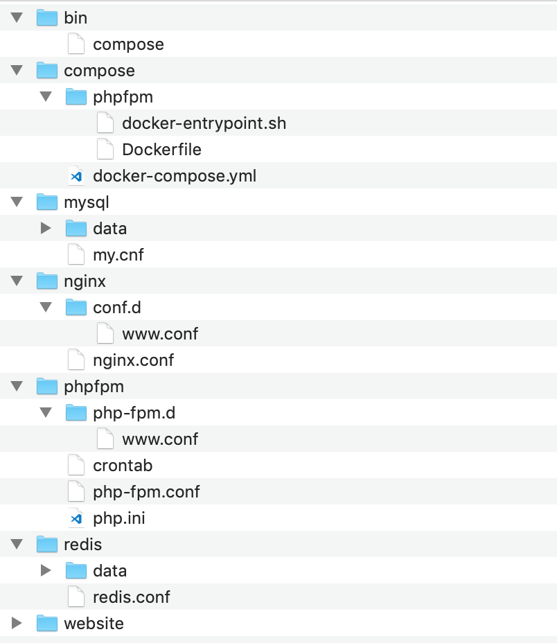

<!-- more -->

## 概念

### Docker 的核心四大组成对象

> 镜像 ( Image )、容器 ( Container )、网络 ( Network )、数据卷 ( Volume )

#### 镜像

所谓镜像，可以理解为一个只读的文件包，其中包含了**虚拟环境运行最原始文件系统的内容**。

每次对镜像内容的修改，Docker 都会将这些修改铸造成一个镜像层，而一个镜像其实就是由其下层所有的镜像层所组成的。当然，每一个镜像层单独拿出来，与它之下的镜像层都可以组成一个镜像。

另外，由于这种结构，Docker 的镜像实质上是无法被修改的，因为所有对镜像的修改只会产生新的镜像，而不是更新原有的镜像。

类似`git`，增量记录文件变更。

##### 镜像命名

准确的来说，镜像的命名我们可以分成三个部分：username、repository 和 tag。

username： 主要用于识别上传镜像的不同用户，与 GitHub 中的用户空间类似。对于 username 来说，在上面我们展示的 docker images 结果中，有的镜像有 username 这个部分，而有的镜像是没有的。没有 username 这个部分的镜像，表示镜像是由 Docker 官方所维护和提供的，所以就不单独标记用户了。
**repository**：主要用于识别进行的内容，形成对镜像的表意描述。Docker 中镜像的 repository 部分通常采用的是软件名，可以任意取名，用软件名，只是为了更易示意。
tag：主要用户表示镜像的版本，方便区分进行内容的不同细节。

#### 容器

容器就是用来隔离虚拟环境的基础设施，而在 Docker 里，它也被引申为**隔离出来的虚拟环境**。通过PID进程隔离，容器中的主进程就是容器本身，杀掉容器中的主进程，相当于杀掉了容器。

如果把镜像理解为编程中的类，那么容器就可以理解为类的实例。镜像内存放的是不可变化的东西，当以它们为基础的容器启动后，容器内也就成为了一个“活”的空间。

用更官方的定义，Docker 的容器应该有三项内容组成：

- 一个 Docker 镜像
- 一个程序运行环境
- 一个指令集合

##### 容器生命周期

Created、Running、Paused、Stopped、Deleted

- Created：容器已经被创建，容器所需的相关资源已经准备就绪，但容器中的程序还未处于运行状态。
- Running：容器正在运行，也就是容器中的应用正在运行。
- Paused：容器已暂停，表示容器中的所有程序都处于暂停 ( 不是停止 ) 状态。
- Stopped：容器处于停止状态，占用的资源和沙盒环境都依然存在，只是容器中的应用程序均已停止。
- Deleted：容器已删除，相关占用的资源及存储在 Docker 中的管理信息也都已释放和移除。

##### 写时复制机制

Docker 的写时复制与编程中的相类似，也就是在通过镜像运行容器时，并不是马上就把镜像里的所有内容拷贝到容器所运行的沙盒文件系统中，而是利用 UnionFS 将镜像以只读的方式挂载到沙盒文件系统中。只有在容器中发生对文件的修改时，修改才会体现到沙盒环境上。

也就是说，容器在创建和启动的过程中，不需要进行任何的文件系统复制操作，也不需要为容器单独开辟大量的硬盘空间，与其他虚拟化方式对这个过程的操作进行对比，Docker 启动的速度可见一斑。

##### 容器互联

由于 Docker 提倡容器与应用共生的轻量级容器理念，所以容器中通常只包含一种应用程序，但我们知道，如今纷繁的系统服务，没有几个是可以通过单一的应用程序支撑的。拿最简单的 Web 应用为例，也至少需要业务应用、数据库应用、缓存应用等组成。也就是说，在 Docker 里我们需要通过多个容器来组成这样的系统。

##### 镜像vs容器

镜像像是记录容器运行环境的模板，是只读的，docker 依照这个模板启动一个容器，容器启动运行时是按需从镜像模板里拿取依赖（写时复制）肯定是先有模板才能依照模板启动容器！没有镜像，容器就是无源之水。镜像像类，容器像类的实例。或者说，镜像是程序是死的，容器是运行的进程，是活的。

#### 网络

网络通讯是目前最常用的一种程序间的数据交换方式，所有的应用都可以通过网络在不同的硬件平台或操作系统平台上进行数据交互。

docker容器间建立虚拟网络，将数个容器包裹其中，同时与其他网络环境隔离。

在 Docker 网络中，有三个比较核心的概念，也就是：沙盒 ( Sandbox )、网络 ( Network )、端点 ( Endpoint )。

- 沙盒提供了容器的虚拟网络栈，也就是之前所提到的端口套接字、IP 路由表、防火墙等的内容。其实现隔离了容器网络与宿主机网络，形成了完全独立的容器网络环境。
- 网络可以理解为 Docker 内部的虚拟子网，网络内的参与者相互可见并能够进行通讯。Docker 的这种虚拟网络也是于宿主机网络存在隔离关系的，其目的主要是形成容器间的安全通讯环境。
- 端点是位于容器或网络隔离墙之上的洞，其主要目的是形成一个可以控制的突破封闭的网络环境的出入口。当容器的端点与网络的端点形成配对后，就如同在这两者之间搭建了桥梁，便能够进行数据传输了。

#### 数据卷

在 Docker 中，通过这几种方式进行数据共享或持久化的文件或目录，我们都称为数据卷 ( Volume )。

在以往的虚拟机中，我们通常直接采用虚拟机的文件系统作为应用数据等文件的存储位置。然而这种方式其实并非完全安全的，当虚拟机或者容器出现问题导致文件系统无法使用时，虽然我们可以很快的通过镜像重置文件系统使得应用快速恢复运行，但是之前存放的数据也就消失了。

为了保证数据的独立性，我们通常会单独挂载一个文件系统来存放数据。这种操作在虚拟机中是繁琐的，因为我们不但要搞定挂载在不同宿主机中实现的方法，还要考虑挂载文件系统兼容性，虚拟操作系统配置等问题。值得庆幸的是，这些在 Docker 里都已经为我们轻松的实现了，我们只需要简单的一两个命令或参数，就能完成文件系统目录的挂载。

基于底层存储实现，Docker 提供了三种适用于不同场景的文件系统挂载方式：Bind Mount、Volume 和 Tmpfs Mount。

- Bind Mount 能够直接将宿主操作系统中的目录和文件挂载到容器内的文件系统中，通过指定容器外的路径和容器内的路径，就可以形成挂载映射关系，在容器内外对文件的读写，都是相互可见的。

- Volume 也是从宿主操作系统中挂载目录到容器内，只不过这个挂载的目录由 Docker 进行管理，我们只需要指定容器内的目录，不需要关心具体挂载到了宿主操作系统中的哪里。

- Tmpfs Mount 支持挂载系统内存中的一部分到容器的文件系统里，不过由于内存和容器的特征，它的存储并不是持久的，其中的内容会随着容器的停止而消失。

#### 其他

Docker 是依赖于 Linux 而存在的，其实 Docker Desktop 的实现逻辑很简单：既然 Windows 和 macOS 中没有 Docker 能够利用的 Linux 环境，那么我们生造一个 Linux 环境就行啦！Docker for Windows 和 Docker for Mac 正是这么实现的。

## 常用命令

- `docker version`

```bash
$ docker version

Client:
 Cloud integration: 1.0.17
 Version:           20.10.7
 API version:       1.41
 Go version:        go1.16.4
 Git commit:        f0df350
 Built:             Wed Jun  2 11:56:22 2021
 OS/Arch:           darwin/amd64
 Context:           default
 Experimental:      true

Server: Docker Engine - Community
 Engine:
  Version:          20.10.7
  API version:      1.41 (minimum version 1.12)
  Go version:       go1.13.15
  Git commit:       b0f5bc3
  Built:            Wed Jun  2 11:54:58 2021
  OS/Arch:          linux/amd64
  Experimental:     false
 containerd:
  Version:          1.4.6
  GitCommit:        d71fcd7d8303cbf684402823e425e9dd2e99285d
 runc:
  Version:          1.0.0-rc95
  GitCommit:        b9ee9c6314599f1b4a7f497e1f1f856fe433d3b7
 docker-init:
  Version:          0.19.0
  GitCommit:        de40ad0

```

- `docker info`

在 docker info 这条命令的结果中，我们可以看到正在运行的 Docker Engine 实例中运行的容器数量，存储的引擎等等信息。

- `docker images`

在 docker images 命令的结果中，我们可以看到镜像的 ID ( IMAGE ID)、构建时间 ( CREATED )、占用空间 ( SIZE ) 等数据。

### 镜像相关

- `docker pull`：拉取镜像
- `docker search`：搜索镜像
- `docker images`：列出本地镜像
- `docker inspect`：查看关于某个镜像相当完备的信息
- `docker rmi`：删除镜像

- `docker commit <container>`：提交容器的更改，例如`docker commit -m "Configured" webapp`，打包生成新镜像。Docker 执行将容器内沙盒文件系统记录成镜像层的时候，会先暂停容器的运行，以保证容器内的文件系统处于一个相对稳定的状态，确保数据的一致性

```bash
# 提交webapp容器的更改，创建备注为Upgrade，名称为webapp，标签为2.0的新镜像
docker commit -m "Upgrade" webapp webapp:2.0
```

- `docker tag`：重命名镜像名

#### 镜像迁移

```bash
# 导出webapp:1.0镜像到./webapp-1.0.tar文件
docker save -o ./webapp-1.0.tar webapp:1.0

# 批量导出
docker save -o ./images.tar webapp:1.0 nginx:1.12 mysql:5.7

# 导入镜像
docker load -i webapp-1.0.tar
```

- `docker export`：commit + save的结合体

### 容器相关

- `docker create <image>`：根据所给出的镜像创建容器，例如：`docker create --name nginx nginx:1.12`
- `docker start <容器名>`：启动容器
- `docker run`：创建(create)并且启动(start)容器，例如：`docker run --name nginx -d nginx:1.12`，`-d`表示在启动后将程序与控制台分离，使其进入“后台”运行。创建时通过`--link`可让一个容器连接到另外一个容器。可以通过`--expose`来暴露容器端口。

```bash
sudo docker run -d --name mysql -e MYSQL_RANDOM_ROOT_PASSWORD=yes mysql
sudo docker run -d --name webapp --link mysql webapp:latest

# 容器间的网络已经打通，那么我们要如何在 Web 应用中连接到 MySQL 数据库呢？Docker 为容器间连接提供了一种非常友好的方式，我们只需要将容器的网络命名填入到连接地址中，就可以访问需要连接的容器了。
# String url = "jdbc:mysql://mysql:3306/webapp";

docker run -d --name mysql -e MYSQL_RANDOM_ROOT_PASSWORD=yes --expose 13306 --expose 23306 mysql:5.7
```

- `docker ps`：列出的容器是处于运行中的容器，`-a`参数，列出所有容器。结果中还可以看到容器暴露给其他容器访问的端口
- `docker stop <name>`：停止容器
- `docker rm <name>`：删除容器，容器中应用程序所产生的一些文件数据，是非常重要的，如果这些数据随着容器的删除而丢失，其损失是非常巨大的。对于这类由应用程序所产生的数据，并且需要保证它们不会随着容器的删除而消失的，我们可以使用 Docker 中的数据卷来单独存放。由于数据卷是独立于容器存在的，所以其能保证数据不会随着容器的删除而丢失
- `docker exec <name> <CMD>`：让容器运行我们所给出的命令，例如：`docker exec nginx more /etc/hostname`
- `docker exec -it nginx bash`，用bash来进入nginx容器，其中 -i ( --interactive ) 表示保持我们的输入流，只有使用它才能保证控制台程序能够正确识别我们的命令。而 -t ( --tty ) 表示启用一个伪终端，形成我们与 bash 的交互，如果没有它，我们无法看到 bash 内部的执行结果

### 网络相关

- `docker network create`：自己定义虚拟子网，例如：`docker network create -d bridge individual`，通过 -d 选项我们可以为新的网络指定驱动的类型，其值可以是刚才我们所提及的 bridge、host、overlay、maclan、none，也可以是其他网络驱动插件所定义的类型。这里我们使用的是 Bridge Driver ( 当我们不指定网络驱动时，Docker 也会默认采用 Bridge Driver 作为网络驱动 )
- `docker network ls`：查看 Docker 中已经存在的网络
- `docker run --network`：在我们创建容器时，可以通过 --network 来指定容器所加入的网络
- `docker run --publish`：映射端口，把容器的端口映射到宿主操作系统的端口上，从外部访问宿主操作系统的端口时，数据请求就会自动发送给与之关联的容器端口，例如：`docker run -d --name nginx -p 80:80 -p 443:443 nginx:1.12`。`-p <ip>:<host-port>:<container-port>` 其中 ip 是宿主操作系统的监听 ip，可以用来控制监听的网卡，默认为 0.0.0.0，也就是监听所有网卡。host-port 和 container-port 分别表示映射到宿主操作系统的端口和容器的端口，这两者是可以不一样的，我们可以将容器的 80 端口映射到宿主操作系统的 8080 端口，传入 -p 8080:80 即可

### 存储相关

- `docker run --volume`：将宿主操作系统中的目录挂载到容器，例如：`docker run -d --name nginx -v /webapp/html:/usr/share/nginx/html nginx:1.12` (参数传递不同，即可实现使用数据卷挂载，参考下一条命令)

使用 -v 或 --volume 来挂载宿主操作系统目录的形式是 -v <host-path>:<container-path> 或 --volume <host-path>:<container-path>，其中 host-path 和 container-path 分别代表宿主操作系统中的目录和容器中的目录。这里需要注意的是，为了避免混淆，Docker 这里强制定义目录时必须使用绝对路径，不能使用相对路径。

我们能够指定目录进行挂载，也能够指定具体的文件来挂载，具体选择何种形式来挂载，大家可以根据具体的情况来选择。可以添加`:ro`实现只读挂载。

当我们需要从宿主操作系统共享配置的时候 和 当我们需要借助 Docker 进行开发的时候(每次对代码的修改都可以直接在容器外部进行)，该挂载方式有实际应用场景。

- `docker run --volume`：例如：`docker run -d --name webapp -v /webapp/storage webapp:latest`，

数据卷的本质其实依然是宿主操作系统上的一个目录，只不过这个目录存放在 Docker 内部，接受 Docker 的管理。在使用数据卷进行挂载时，我们不需要知道数据具体存储在了宿主操作系统的何处，只需要给定容器中的哪个目录会被挂载即可。

- `-v <name>:<container-path>`：数据卷命名，例如：`docker run -d --name webapp -v appdata:/webapp/storage webapp:latest`，命名为`appdata`

数据卷的命名在 Docker 中是唯一的

- `docker volume create <name>`：创建数据卷
- `docker volume ls`：列出数据卷
- `docker volume rm <name>`：删除数据卷，在删除容器时，可以使用`docker rm -v <container-name>`来删除容器的同时删除关联的数据卷

如果我们没有随容器删除这些数据卷，Docker 在创建新的容器时也不会启用它们，即使它们与新创建容器所定义的数据卷有完全一致的特征。也就是说，此时它们已经变成了孤魂野鬼，纯粹的占用着硬盘空间而又不受管理。

- `docker volume prune`：删除那些没有被容器引用的数据卷

#### 数据卷容器

创建数据卷容器的方式很简单，由于不需要容器本身运行，因而我们找个简单的系统镜像都可以完成创建：`docker create --name appdata -v /webapp/storage ubuntu`，使用`ubuntu`镜像来创建名为`appdata`的数据卷容器

数据卷容器就可以算是容器间的文件系统桥梁，可以像加入网络一样引用数据卷容器，只需要在创建新容器时使用专门的 --volumes-from 选项即可，`sudo docker run -d --name webapp --volumes-from appdata webapp:latest`

#### 数据卷备份和迁移

由于数据卷本身就是宿主操作系统中的一个目录，我们只需要在 Docker 资源目录里找到它就可以很轻松的打包、迁移、恢复了。虽然这么做相对其他虚拟化方案来说已经很简单了，但在 Docker 里还不是最优雅的解决方式。

利用数据卷容器，我们还能够更方便的对数据卷中的数据进行迁移。

数据备份、迁移、恢复的过程可以理解为对数据进行打包，移动到其他位置，在需要的地方解压的过程。在数据打包之前，我们先建立一个用来存放打包文件的目录，这里我们使用 /backup 作为例子。

要备份数据，我们先建立一个临时的容器，将用于备份的目录和要备份的数据卷都挂载到这个容器上。

在备份命令中，除了挂载的配置外，我们再注意几个选项。通过 --rm 选项，我们可以让容器在停止后自动删除，而不需要我们再使用容器删除命令来删除它，这对于我们使用一些临时容器很有帮助。在容器所基于的镜像之后，我们还看到了一串命令，也就是 tar cvf /backup/backup.tar /webapp/storage，其实如果我们在镜像定义之后接上命令，可以直接替换掉镜像所定义的主程序启动命令，而去执行这一条命令。在很多场合下，我们还能通过这个方法干很多不同的事情。

在备份后，我们就可以在 /backup 下找到数据卷的备份文件，也就是 backup.tar 了。

如果要恢复数据卷中的数据，我们也可以借助临时容器完成。

```bash
# 备份
docker run --rm --volumes-from appdata -v /backup:/backup ubuntu tar cvf /backup/backup.tar /webapp/storage

# 恢复 (恢复的过程与备份的过程类似，只不过把打包的命令转换为解包的命令而已)
docker run --rm --volumes-from appdata -v /backup:/backup ubuntu tar xvf /backup/backup.tar -C /webapp/storage --strip
```

## 笔记

### 修改国内镜像源

在`Docker Desktop`的docker engine中配置增加`registry-mirrors`

```json
{
    "registry-mirrors": [
        "https://registry.docker-cn.com"
    ]
}
```

## 通过 Dockerfile 创建镜像

Dockerfile 是 Docker 中用于定义镜像自动化构建流程的配置文件，在 Dockerfile 中，包含了构建镜像过程中需要执行的命令和其他操作。通过 Dockerfile 我们可以更加清晰、明确的给定 Docker 镜像的制作过程，而由于其仅是简单、小体积的文件，在网络等其他介质中传递的速度极快，能够更快的帮助我们实现容器迁移和集群部署。

### 编写

相对于之前我们介绍的提交容器修改，再进行镜像迁移的方式相比，使用 Dockerfile 进行这项工作有很多优势，我总结了几项尤为突出的。

- Dockerfile 的体积远小于镜像包，更容易进行快速迁移和部署。
- 环境构建流程记录了 Dockerfile 中，能够直观的看到镜像构建的顺序和逻辑。
- 使用 Dockerfile 来构建镜像能够更轻松的实现自动部署等自动化流程。
- 在修改环境搭建细节时，修改 Dockerfile 文件要比从新提交镜像来的轻松、简单。

#### Dockerfile 的结构

总体上来说，我们可以将 Dockerfile 理解为一个由上往下执行指令的脚本文件。当我们调用构建命令让 Docker 通过我们给出的 Dockerfile 构建镜像时，Docker 会逐一按顺序解析 Dockerfile 中的指令，并根据它们不同的含义执行不同的操作。

如果进行细分，我们可以将 Dockerfile 的指令简单分为五大类。

- 基础指令：用于定义新镜像的基础和性质。
- 控制指令：是指导镜像构建的核心部分，用于描述镜像在构建过程中需要执行的命令。
- 引入指令：用于将外部文件直接引入到构建镜像内部。
- 执行指令：能够为基于镜像所创建的容器，指定在启动时需要执行的脚本或命令。
- 配置指令：对镜像以及基于镜像所创建的容器，可以通过配置指令对其网络、用户等内容进行配置。

这五类命令并非都会出现在一个 Dockerfile 里，但却对基于这个 Dockerfile 所构建镜像形成不同的影响。

#### 常见 Dockerfile 指令

- FROM

通常来说，我们不会从零开始搭建一个镜像，而是会选择一个已经存在的镜像作为我们新镜像的基础，这种方式能够大幅减少我们的时间。

在 Dockerfile 里，我们可以通过 FROM 指令指定一个基础镜像，接下来所有的指令都是基于这个镜像所展开的。在镜像构建的过程中，Docker 也会先获取到这个给出的基础镜像，再从这个镜像上进行构建操作。

FROM 指令支持三种形式，不管是哪种形式，其核心逻辑就是指出能够被 Docker 识别的那个镜像，好让 Docker 从那个镜像之上开始构建工作。

```bash
FROM <image> [AS <name>]
FROM <image>[:<tag>] [AS <name>]
FROM <image>[@<digest>] [AS <name>]
```

既然选择一个基础镜像是构建新镜像的根本，那么 Dockerfile 中的第一条指令必须是 FROM 指令，因为没有了基础镜像，一切构建过程都无法开展。

当然，一个 Dockerfile 要以 FROM 指令作为开始并不意味着 FROM 只能是 Dockerfile 中的第一条指令。在 Dockerfile 中可以多次出现 FROM 指令，当 FROM 第二次或者之后出现时，表示在此刻构建时，要将当前指出镜像的内容合并到此刻构建镜像的内容里。这对于我们直接合并两个镜像的功能很有帮助。

- RUN

镜像的构建虽然是按照指令执行的，但指令只是引导，最终大部分内容还是控制台中对程序发出的命令，而 RUN 指令就是用于向控制台发送命令的指令。

在 RUN 指令之后，我们直接拼接上需要执行的命令，在构建时，Docker 就会执行这些命令，并将它们对文件系统的修改记录下来，形成镜像的变化。

```bash
RUN <command>
RUN ["executable", "param1", "param2"]
```

- ENTRYPOINT 和 CMD

基于镜像启动的容器，在容器启动时会根据镜像所定义的一条命令来启动容器中进程号为 1 的进程。而这个命令的定义，就是通过 Dockerfile 中的 ENTRYPOINT 和 CMD 实现的。

```bash
ENTRYPOINT ["executable", "param1", "param2"]
ENTRYPOINT command param1 param2

CMD ["executable","param1","param2"]
CMD ["param1","param2"]
CMD command param1 param2
```

ENTRYPOINT 指令和 CMD 指令的用法近似，都是给出需要执行的命令，并且它们都可以为空，或者说是不在 Dockerfile 里指出。

当 ENTRYPOINT 与 CMD 同时给出时，CMD 中的内容会作为 ENTRYPOINT 定义命令的参数，最终执行容器启动的还是 ENTRYPOINT 中给出的命令。

- EXPOSE

由于我们构建镜像时更了解镜像中应用程序的逻辑，也更加清楚它需要接收和处理来自哪些端口的请求，所以在镜像中定义端口暴露显然是更合理的做法。

通过 EXPOSE 指令就可以为镜像指定要暴露的端口。

```bash
EXPOSE <port> [<port>/<protocol>...]
```

当我们通过 EXPOSE 指令配置了镜像的端口暴露定义，那么基于这个镜像所创建的容器，在被其他容器通过 --link 选项连接时，就能够直接允许来自其他容器对这些端口的访问了。

- VOLUME

在一些程序里，我们需要持久化一些数据，比如数据库中存储数据的文件夹就需要单独处理。在之前的小节里，我们提到可以通过数据卷来处理这些问题。

但使用数据卷需要我们在创建容器时通过 -v 选项来定义，而有时候由于镜像的使用者对镜像了解程度不高，会漏掉数据卷的创建，从而引起不必要的麻烦。

还是那句话，制作镜像的人是最清楚镜像中程序工作的各项流程的，所以它来定义数据卷也是最合适的。所以在 Dockerfile 里，提供了 VOLUME 指令来定义基于此镜像的容器所自动建立的数据卷。

```bash
VOLUME ["/data"]
```

在 VOLUME 指令中定义的目录，在基于新镜像创建容器时，会自动建立为数据卷，不需要我们再单独使用 -v 选项来配置了。

- COPY 和 ADD

在制作新的镜像的时候，我们可能需要将一些软件配置、程序代码、执行脚本等直接导入到镜像内的文件系统里，使用 COPY 或 ADD 指令能够帮助我们直接从宿主机的文件系统里拷贝内容到镜像里的文件系统中。

```bash
COPY [--chown=<user>:<group>] <src>... <dest>
ADD [--chown=<user>:<group>] <src>... <dest>

COPY [--chown=<user>:<group>] ["<src>",... "<dest>"]
ADD [--chown=<user>:<group>] ["<src>",... "<dest>"]
```

COPY 与 ADD 指令的定义方式完全一样，需要注意的仅是当我们的目录中存在空格时，可以使用后两种格式避免空格产生歧义。

对比 COPY 与 ADD，两者的区别主要在于 ADD 能够支持使用网络端的 URL 地址作为 src 源，并且在源文件被识别为压缩包时，自动进行解压，而 COPY 没有这两个能力。

虽然看上去 COPY 能力稍弱，但对于那些不希望源文件被解压或没有网络请求的场景，COPY 指令是个不错的选择。

### 构建镜像

```bash
# -t 名称
# -f 依赖的Dockerfile文件
# ./webapp 脚本执行依赖的路径，比如复制文件等
docker build -t webapp:latest -f ./webapp/a.Dockerfile ./webapp
```

- `-t` 选项，用它来指定新生成镜像的名称

### 常见技巧

#### 构建中使用变量

在 Dockerfile 里，我们可以用 ARG 指令来建立一个参数变量，我们可以在构建时通过构建指令传入这个参数变量，并且在 Dockerfile 里使用它。

例如，我们希望通过参数变量控制 Dockerfile 中某个程序的版本，在构建时安装我们指定版本的软件，我们可以通过 ARG 定义的参数作为占位符，替换版本定义的部分。

```bash
FROM debian:stretch-slim

## ......

ARG TOMCAT_MAJOR
ARG TOMCAT_VERSION

## ......

RUN wget -O tomcat.tar.gz "https://www.apache.org/dyn/closer.cgi?action=download&filename=tomcat/tomcat-$TOMCAT_MAJOR/v$TOMCAT_VERSION/bin/apache-tomcat-$TOMCAT_VERSION.tar.gz"

## ......
```

在这个例子里，我们将 Tomcat 的版本号通过 ARG 指令定义为参数变量，在调用下载 Tomcat 包时，使用变量替换掉下载地址中的版本号。通过这样的定义，就可以让我们在不对 Dockerfile 进行大幅修改的前提下，轻松实现对 Tomcat 版本的切换并重新构建镜像了。

如果我们需要通过这个 Dockerfile 文件构建 Tomcat 镜像，我们可以在构建时通过 docker build 的 --build-arg 选项来设置参数变量。

```bash
sudo docker build --build-arg TOMCAT_MAJOR=8 --build-arg TOMCAT_VERSION=8.0.53 -t tomcat:8.0 ./tomcat
```

#### 环境变量

环境变量也是用来定义参数的东西，与 ARG 指令相类似，环境变量的定义是通过 ENV 这个指令来完成的。

```bash
FROM debian:stretch-slim

## ......

ENV TOMCAT_MAJOR 8
ENV TOMCAT_VERSION 8.0.53

## ......

RUN wget -O tomcat.tar.gz "https://www.apache.org/dyn/closer.cgi?action=download&filename=tomcat/tomcat-$TOMCAT_MAJOR/v$TOMCAT_VERSION/bin/apache-tomcat-$TOMCAT_VERSION.tar.gz"

```

环境变量的使用方法与参数变量一样，也都是能够直接替换指令参数中的内容。

与参数变量只能影响构建过程不同，环境变量不仅能够影响构建，还能够影响基于此镜像创建的容器。环境变量设置的实质，其实就是定义操作系统环境变量，所以在运行的容器里，一样拥有这些变量，而容器中运行的程序也能够得到这些变量的值。

另一个不同点是，环境变量的值不是在构建指令中传入的，而是在 Dockerfile 中编写的，所以如果我们要修改环境变量的值，我们需要到 Dockerfile 修改。不过即使这样，只要我们将 ENV 定义放在 Dockerfile 前部容易查找的地方，其依然可以很快的帮助我们切换镜像环境中的一些内容。

由于环境变量在容器运行时依然有效，所以运行容器时我们还可以对其进行覆盖，在创建容器时使用 -e 或是 --env 选项，可以对环境变量的值进行修改或定义新的环境变量。

```bash
sudo docker run -e MYSQL_ROOT_PASSWORD=my-secret-pw -d mysql:5.7
```

事实上，这种用法在我们开发中是非常常见的。也正是因为这种允许运行时配置的方法存在，环境变量和定义它的 ENV 指令，是我们更常使用的指令，我们会优先选择它们来实现对变量的操作。

另外需要说明一点，通过 ENV 指令和 ARG 指令所定义的参数，在使用时都是采用 $ + NAME 这种形式来占位的，所以它们之间的定义就存在冲突的可能性。对于这种场景，大家只需要记住，ENV 指令所定义的变量，永远会覆盖 ARG 所定义的变量，即使它们定时的顺序是相反的。

#### 合并命令

在上一节我们展示的完整的官方 Redis 镜像的 Dockerfile 中，我们会发现 RUN 等指令里会聚合下大量的代码。

事实上，下面两种写法对于搭建的环境来说是没有太大区别的。

```bash
# 只会打一个commit，增加一个镜像层 (优先使用该种)
RUN apt-get update; \
    apt-get install -y --no-install-recommends $fetchDeps; \
    rm -rf /var/lib/apt/lists/*;

# 增加三个镜像层
RUN apt-get update
RUN apt-get install -y --no-install-recommends $fetchDeps
RUN rm -rf /var/lib/apt/lists/*
```

#### 构建缓存

Docker 在镜像构建的过程中，还支持一种缓存策略来提高镜像的构建速度。

由于镜像是多个指令所创建的镜像层组合而得，那么如果我们判断新编译的镜像层与已经存在的镜像层未发生变化，那么我们完全可以直接利用之前构建的结果，而不需要再执行这条构建指令，这就是镜像构建缓存的原理。

那么 Docker 是如何判断镜像层与之前的镜像间不存在变化的呢？这主要参考两个维度，第一是所基于的镜像层是否一样，第二是用于生成镜像层的指令的内容是否一样。

基于这个原则，我们在条件允许的前提下，更建议将不容易发生变化的搭建过程放到 Dockerfile 的前部，充分利用构建缓存提高镜像构建的速度。另外，指令的合并也不宜过度，而是将易变和不易变的过程拆分，分别放到不同的指令里。

在另外一些时候，我们可能不希望 Docker 在构建镜像时使用构建缓存，这时我们可以通过 --no-cache 选项来禁用它。

```bash
docker build --no-cache ./webapp
```

#### 搭配 ENTRYPOINT 和 CMD

上一节我们谈到了 ENTRYPOINT 和 CMD 这两个命令，也解释了这两个命令的目的，即都是用来指定基于此镜像所创建容器里主进程的启动命令的。

两个指令的区别在于，ENTRYPOINT 指令的优先级高于 CMD 指令。当 ENTRYPOINT 和 CMD 同时在镜像中被指定时，CMD 里的内容会作为 ENTRYPOINT 的参数，两者拼接之后，才是最终执行的命令。

有的读者会存在疑问，既然两者都是用来定义容器启动命令的，为什么还要分成两个，合并为一个指令岂不是更方便吗？

这其实在于 ENTRYPOINT 和 CMD 设计的目的是不同的。**ENTRYPOINT 指令主要用于对容器进行一些初始化，而 CMD 指令则用于真正定义容器中主程序的启动命令**。

另外，我们之前谈到创建容器时可以改写容器主程序的启动命令，而这个覆盖只会覆盖 CMD 中定义的内容，而不会影响 ENTRYPOINT 中的内容。

我们依然以之前的 Redis 镜像为例，这是 Redis 镜像中对 ENTRYPOINT 和 CMD 的定义。

```bash
## ......

COPY docker-entrypoint.sh /usr/local/bin/

ENTRYPOINT ["docker-entrypoint.sh"]

## ......

CMD ["redis-server"]
```

可以很清晰的看到，CMD 指令定义的正是启动 Redis 的服务程序，而 ENTRYPOINT 使用的是一个外部引入的脚本文件。

事实上，使用脚本文件来作为 ENTRYPOINT 的内容是常见的做法，因为对容器运行初始化的命令相对较多，全部直接放置在 ENTRYPOINT 后会特别复杂。

我们来看看 Redis 中的 ENTRYPOINT 脚本，可以看到其中会根据脚本参数进行一些处理，而脚本的参数，其实就是 CMD 中定义的内容。

```sh
#!/bin/sh
set -e

# first arg is `-f` or `--some-option`
# or first arg is `something.conf`
if [ "${1#-}" != "$1" ] || [ "${1%.conf}" != "$1" ]; then
  set -- redis-server "$@"
fi

# allow the container to be started with `--user`
if [ "$1" = 'redis-server' -a "$(id -u)" = '0' ]; then
  find . \! -user redis -exec chown redis '{}' +
  exec gosu redis "$0" "$@"
fi

exec "$@"
```

这里我们要关注脚本最后的一条命令，也就是 exec "$@"。在很多镜像的 ENTRYPOINT 脚本里，我们都会看到这条命令，其作用其实很简单，就是运行一个程序，而运行命令就是 ENTRYPOINT 脚本的参数。反过来，由于 ENTRYPOINT 脚本的参数就是 CMD 指令中的内容，所以实际执行的就是 CMD 里的命令。

所以说，虽然 Docker 对容器启动命令的结合机制为 CMD 作为 ENTRYPOINT 的参数，合并后执行 ENTRYPOINT 中的定义，但实际在我们使用中，我们还会在 ENTRYPOINT 的脚本里代理到 CMD 命令上。

#### 使用Alpine镜像

如果大家多接触几个镜像，就会发现带有 Alpine 的版本是许多镜像中都常见的标签。带有 Alpine 标签的镜像到底是什么样的存在呢？它与相同软件不同标签的镜像又有什么样的区别呢？

镜像标签中的 Alpine 其实指的是这个镜像内的文件系统内容，是基于 Alpine Linux 这个操作系统的。Alpine Linux 是一个相当精简的操作系统，而基于它的 Docker 镜像可以仅有数 MB 的尺寸。如果软件基于这样的系统镜像之上构建而得，可以想象新的镜像也是十分小巧的。

## Docker Compose 容器编排

由于 Docker 采用轻量级容器的设计，每个容器一般只运行一个软件，而目前绝大多数应用系统都绝不是一个软件所能组成的。虽然我们之前提到了容器间互相连接、交换数据的各种方法，通过这些方法足以搭建起完整的用于应用系统运行的容器群，但是这显然还不够，这个容器群的搭建需要执行太多命令，更重要的是需要考虑太多应用和容器间的依赖关系处理，是一波令人头大的操作。在这一节中，我们就来介绍如何解决这些问题。

### 容器管理问题

拿任何一个相对完整的应用系统来说，都不可能是由一个程序独立支撑的，而对于使用 Docker 来部署的分布式计算服务更是这样。随着时代的发展和技术演进，我们越来越推崇将大型服务拆分成较小的微服务，分别部署到独立的机器或容器中。也就是说，我们的应用系统往往由数十个甚至上百个应用程序或微服务组成。即使是一个小的微服务模块，通常都需要多个应用协作完成工作。

我们编写一个小型的微服务模块，虽然我们编写代码主要针对的是其中的应用部分，但如果我们要完整的进行开发、测试，与应用相关的周边软件必然是必不可少的。

虽然 Docker Engine 帮助我们完成了对应用运行环境的封装，我们可以不需要记录复杂的应用环境搭建过程，通过简单的配置便可以将应用运行起来了，但这只是针对单个容器或单个应用程序来说的。如果延伸到由多个应用组成的应用系统，那情况就稍显复杂了。

就拿最简单的例子来说吧，如果我们要为我们的应用容器准备一个 MySQL 容器和一个 Redis 容器，那么在每次启动时，我们先要将 MySQL 容器和 Redis 容器启动起来，再将应用容器运行起来。这其中还不要忘了在创建应用容器时将容器网络连接到 MySQL 容器和 Redis 容器上，以便应用连接上它们并进行数据交换。

这还不够，如果我们还对容器进行了各种配置，我们最好还得将容器创建和配置的命令保存下来，以便下次可以直接使用。

如果我们要想让这套体系像 docker run 和 docker rm 那样自如的进行无痕切换，那就更加麻烦了，我们可能需要编写一些脚本才能不至于被绕到命令的毛线球里。

说了这么多，其实核心还是缺少一个对容器组合进行管理的东西。

针对这种情况，我们就不得不引出在我们开发中最常使用的多容器定义和运行软件，也就是 Docker Compose 了。

如果说 Dockerfile 是将容器内运行环境的搭建固化下来，那么 Docker Compose 我们就可以理解为将多个容器运行的方式和配置固化下来。

在 Docker Compose 里，我们通过一个配置文件，将所有与应用系统相关的软件及它们对应的容器进行配置，之后使用 Docker Compose 提供的命令进行启动，就能让 Docker Compose 将刚才我们所提到的那些复杂问题解决掉。

### 编写 Docker Compose 配置

配置文件是 Docker Compose 的核心部分，我们正是通过它去定义组成应用服务容器群的各项配置，而编写配置文件，则是使用 Docker Compose 过程中最核心的一个步骤。

Docker Compose 的配置文件是一个基于 YAML 格式的文件。关于 YAML 的语法大家可以在网上找到，这里不再细说，总的来说，YAML 是一种清晰、简单的标记语言，你甚至都可以在看过几个例子后摸索出它的语法。

与 Dockerfile 采用 Dockerfile 这个名字作为镜像构建定义的默认文件名一样，Docker Compose 的配置文件也有一个缺省的文件名，也就是 docker-compose.yml，如非必要，我建议大家直接使用这个文件名来做 Docker Compose 项目的定义。

```yaml
version: '3'

services:

  webapp:
    build: ./image/webapp
    ports:
      - "5000:5000"
    volumes:
      - ./code:/code
      - logvolume:/var/log
    links:
      - mysql
      - redis

  redis:
    image: redis:3.2
  
  mysql:
    image: mysql:5.7
    environment:
      - MYSQL_ROOT_PASSWORD=my-secret-pw

volumes:
  logvolume: {}
```

Docker Compose 配置文件里可以包含许多内容，从每个容器的各个细节控制，到网络、数据卷等的定义。

这里我们看几个主要的细节。首先是 version 这个配置，这代表我们定义的 docker-compose.yml 文件内容所采用的版本，目前 Docker Compose 的配置文件已经迭代至了第三版，其所支持的功能也越来越丰富，所以我们建议使用最新的版本来定义。

接下来我们来看 services 这块，这是整个 docker-compose.yml 的核心部分，其定义了容器的各项细节。

在 Docker Compose 里不直接体现容器这个概念，这是把 service 作为配置的最小单元。虽然我们看上去每个 service 里的配置内容就像是在配置容器，但其实 service 代表的是一个应用集群的配置。每个 service 定义的内容，可以通过特定的配置进行水平扩充，将同样的容器复制数份形成一个容器集群。而 Docker Compose 能够对这个集群做到黑盒效果，让其他的应用和容器无法感知它们的具体结构。

### 启动和停止

- 启动：`docker-compose up -d`，-d代表后台执行

需要注意的是，docker-compose 命令默认会识别当前控制台所在目录内的 docker-compose.yml 文件，而会以这个目录的名字作为组装的应用项目的名称。如果我们需要改变它们，可以通过选项 -f 来修改识别的 Docker Compose 配置文件，通过 -p 选项来定义项目名(一堆容器构成一个项目，即一个服务)。

```bash
docker-compose -f ./compose/docker-compose.yml -p myapp up -d
```

- 停止所有的容器，并将它们删除，同时消除网络等配置内容，也就是几乎将这个 Docker Compose 项目的所有影响从 Docker 中清除。

```bash
docker-compose down
```

如果条件允许，我更建议大家像容器使用一样对待 Docker Compose 项目，做到随用随启，随停随删。也就是使用的时候通过 docker-compose up 进行，而短时间内不再需要时，通过 docker-compose down 清理它。

借助 Docker 容器的秒级启动和停止特性，我们在使用 docker-compose up 和 docker-compose down 时可以非常快的完成操作。这就意味着，我们可以在不到半分钟的时间内停止一套环境，切换到另外一套环境，这对于经常进行多个项目开发的朋友来说，绝对是福音。

通过 Docker 让我们能够在开发过程中搭建一套不受干扰的独立环境，让开发过程能够基于稳定的环境下进行。而 Docker Compose 则让我们更近一步，同时让我们处理好多套开发环境，并进行快速切换。

### 容器命令

除了启动和停止命令外，Docker Compose 还为我们提供了很多直接操作服务的命令。之前我们说了，服务可以看成是一组相同容器的集合，所以操作服务就有点像操作容器一样。

这些命令看上去都和 Docker Engine 中对单个容器进行操作的命令类似，我们来看几个常见的。

在 Docker Engine 中，如果我们想要查看容器中主进程的输出内容，可以使用 docker logs 命令。而由于在 Docker Compose 下运行的服务，其命名都是由 Docker Compose 自动完成的，如果我们直接使用 docker logs 就需要先找到容器的名字，这显然有些麻烦了。我们可以直接使用 docker-compose logs 命令来完成这项工作。

```bash
docker-compose logs nginx
```

在 docker-compose logs 衔接的是 Docker Compose 中所定义的服务的名称。

同理，在 Docker Compose 还有几个类似的命令可以单独控制某个或某些服务。

通过 docker-compose create，docker-compose start 和 docker-compose stop 我们可以实现与 docker create，docker start 和 docker stop 相似的效果，只不过操作的对象由 Docker Engine 中的容器变为了 Docker Compose 中的服务。

```bash
docker-compose create webapp
docker-compose start webapp
docker-compose stop webap
```

### 常用的 Docker Compose 配置项

#### 配置示例

```yaml
version: "3"

services:

  # 服务名称
  redis:
    image: redis:3.2
    networks:
      - backend
    volumes:
      - ./redis/redis.conf:/etc/redis.conf:ro
    ports:
      - "6379:6379"
    command: ["redis-server", "/etc/redis.conf"]

  # 服务名称
  database:
    image: mysql:5.7
    networks:
      - backend
    volumes:
      - ./mysql/my.cnf:/etc/mysql/my.cnf:ro
      - mysql-data:/var/lib/mysql
    environment:
      - MYSQL_ROOT_PASSWORD=my-secret-pw
    ports:
      - "3306:3306"

  # 服务名称
  webapp:
    build: ./webapp
    networks:
      - frontend
      - backend
    volumes:
      - ./webapp:/webapp
    depends_on:
      - redis
      - database

  # 服务名称
  nginx:
    image: nginx:1.12
    networks:
      - frontend
    volumes:
      - ./nginx/nginx.conf:/etc/nginx/nginx.conf:ro
      - ./nginx/conf.d:/etc/nginx/conf.d:ro
      - ./webapp/html:/webapp/html
    depends_on:
      - webapp
    ports:
      - "80:80"
      - "443:443"

networks:
  frontend:
  backend:

volumes:
  mysql-data:
```

#### 指定镜像

容器最基础的就是镜像了，所以每个服务必须指定镜像。在 Docker Compose 里，我们可以通过两种方式为服务指定所采用的镜像。一种是通过 `image` 这个配置，这个相对简单，给出能在镜像仓库中找到镜像的名称即可。

另外一种指定镜像的方式就是直接采用 `Dockerfile` 来构建镜像，通过 build 这个配置我们能够定义构建的环境目录，这与 docker build 中的环境目录是同一个含义。如果我们通过这种方式指定镜像，那么 Docker Compose 先会帮助我们执行镜像的构建，之后再通过这个镜像启动容器。

```yaml
## ......
  webapp:
    build:
      context: ./webapp
      dockerfile: webapp-dockerfile
      args:
        - JAVA_VERSION=1.6
## ......
```

在配置文件里，我们还能用 Map 的形式来定义 build，在这种格式下，我们能够指定更多的镜像构建参数，例如 Dockerfile 的文件名，构建参数等等。

当然，对于一些可以不通过重新构建镜像的方式便能修改的内容，我们还是不建议重新构建镜像，而是使用原有的镜像做简单的修改。

例如上面的配置里，我们希望修改 Redis 的启动命令，加入配置文件以便对 Redis 服务进行配置，那么我们可以直接通过 command 配置来修改。而在 MySQL 的定义，我们通过 environment 配置为 MySQL 设置了初始密码。

这些对镜像的使用方法我们在之前都已经谈到过了，只不过我们之前用的是 Docker Engine 的命令以及其选项来控制的，而在 Docker Compose 里，我们直接通过配置文件来定义它们。

由于 Docker Compose 的配置已经固化下来，所以我们不需要担心忘记之前执行了哪些命令来启动容器，当每次需要开启或关闭环境时，只需要 docker-compose up -d 和 docker-compose down 命令，就能轻松完成操作。

#### 依赖声明 (depends_on)

> 容器启动顺序

虽然我们在 Docker Compose 的配置文件里定义服务，在书写上有由上至下的先后关系，但实际在容器启动中，由于各种因素的存在，其顺序还是无法保障的。

所以，如果我们的服务间有非常强的依赖关系，我们就必须告知 Docker Compose 容器的先后启动顺序。只有当被依赖的容器完全启动后，Docker Compose 才会创建和启动这个容器。

定义依赖的方式很简单，在上面的例子里我们已经看到了，也就是 depends_on 这个配置项，我们只需要通过它列出这个服务所有依赖的其他服务即可。在 Docker Compose 为我们启动项目的时候，会检查所有依赖，形成正确的启动顺序并按这个顺序来依次启动容器。

#### 文件挂载

在 Docker Compose 里定义文件挂载的方式与 Docker Engine 里也并没有太多的区别，使用 volumes 配置可以像 docker CLI 里的 -v 选项一样来指定外部挂载和数据卷挂载。

在上面的例子里，我们看到了定义几种常用挂载的方式。我们能够直接挂载宿主机文件系统中的目录，也可以通过数据卷的形式挂载内容。

在使用外部文件挂载的时候，我们可以直接指定相对目录进行挂载，这里的相对目录是指相对于 docker-compose.yml 文件的目录。

由于有相对目录这样的机制，我们可以将 docker-compose.yml 和所有相关的挂载文件放置到同一个文件夹下，形成一个完整的项目文件夹。这样既可以很好的整理项目文件，也利于完整的进行项目迁移。

虽然 Docker 提倡将代码或编译好的程序通过构建镜像的方式打包到镜像里，随整个 CI 流部署到服务器中，但对于开发者来说，每次修改程序进行简单测试都要重新构建镜像简直是浪费生命的操作。**所以在开发时，我们推荐直接将代码挂载到容器里，而不是通过镜像构建的方式打包成镜像。**

同时，**在开发过程中，对于程序的配置等内容，我们也建议直接使用文件挂载的形式挂载到容器里**，避免经常修改所带来的麻烦。

##### 使用数据卷

如果我们要在项目中使用数据卷来存放特殊的数据，我们也可以让 Docker Compose 自动完成对数据卷的创建，而不需要我们单独进行操作。

在上面的例子里，独立于 services 的 volumes 配置就是用来声明数据卷的。定义数据卷最简单的方式仅需要提供数据卷的名称，对于我们在 Docker Engine 中创建数据卷时能够使用的其他定义，也能够放入 Docker Compose 的数据卷定义中。

如果我们想把属于 Docker Compose 项目以外的数据卷引入进来直接使用，我们可以将数据卷定义为外部引入，通过 external 这个配置就能完成这个定义。

```yaml
## ......
volumes:
  mysql-data:
    external: true
## ......
```

在加入 external 定义后，Docker Compose 在创建项目时不会直接创建数据卷，而是优先从 Docker Engine 中已有的数据卷里寻找并直接采用。

#### 配置网络

网络也是容器间互相访问的桥梁，所以网络的配置对于多个容器组成的应用系统来说也是非常重要的。在 Docker Compose 里，我们可以为整个应用系统设置一个或多个网络。

要使用网络，我们必须先声明网络。声明网络的配置同样独立于 services 存在，是位于根配置下的 networks 配置。在上面的例子里，我们已经看到了声明 frontend 和 backend 这两个网络最简单的方式。

除了简单的声明网络名称，让 Docker Compose 自动按默认形式完成网络配置外，我们还可以显式的指定网络的参数。

```yaml
networks:
  frontend:
    driver: bridge
    ipam:
      driver: default
      config:
        - subnet: 10.10.1.0/24
## ......
```

在这里，我们为网络定义了网络驱动的类型，并指定了子网的网段。

##### 使用网络别名

直接使用容器名或服务名来作为连接其他服务的网络地址，因为缺乏灵活性，常常还不能满足我们的需要。这时候我们可以为服务单独设置网络别名，在其他容器里，我们将这个别名作为网络地址进行访问。

网络别名的定义方式很简单，这里需要将之前简单的网络 List 定义结构修改成 Map 结构，以便在网络中加入更多的定义。

```yaml
## ......
  database:
    networks:
      backend:
        aliases:
          - backend.database
## ......
  webapp:
    networks:
      backend:
        aliases:
          - backend.webapp
      frontend:
        aliases:
          - frontend.webapp
## ......
```

在我们进行这样的配置后，我们便可以使用这里我们所设置的网络别名对其他容器进行访问了。

##### 端口映射

在 Docker Compose 的每个服务配置里，我们还看到了 ports 这个配置项，它是用来定义端口映射的。

我们可以利用它进行宿主机与容器端口的映射，这个配置与 docker CLI 中 -p 选项的使用方法是近似的。

需要注意的是，由于 YAML 格式对 xx:yy 这种格式的解析有特殊性，在设置小于 60 的值时，会被当成时间而不是字符串来处理，所以我们最好使用引号将端口映射的定义包裹起来，避免歧义。

## 编写 Docker Compose 项目 (实践一)

### 编写 Docker Compose 项目

在这一小节里，我们以一个由 MySQL、Redis、PHP-FPM 和 Nginx 组成的小型 PHP 网站为例，介绍通过 Docker 搭建运行这套程序运行环境的方法。

既然我们说到这个小型网站是由 MySQL、Redis、PHP-FPM 和 Nginx 四款软件所组成的，那么自然在 Docker 里，我们要准备四个容器分别来运行它们。而为了更好地管理这四个容器所组成的环境，我们这里还会使用到 Docker Compose。

与搭建一个软件开发项目类似，我们提倡将 Docker Compose 项目的组成内容聚集到一个文件目录中，这样更利于我们进行管理和迁移。



简单说明一下这个结构中主要目录和文件的功能和作用。在这个结构里，我们可以将根目录下的几个目录分为四类：

- 第一类是 Docker 定义目录，也就是 compose 这个目录。在这个目录里，包含了 docker-compose.yml 这个用于定义 Docker Compose 项目的配置文件。此外，还包含了我们用于构建自定义镜像的内容。
- 第二类是程序文件目录，在这个项目里是 mysql、nginx、phpfpm、redis 这四个目录。这些目录分别对应着 Docker Compose 中定义的服务，在其中主要存放对应程序的配置，产生的数据或日志等内容。
- 第三类是代码目录，在这个项目中就是存放 Web 程序的 website 目录。我们将代码统一放在这个目录中，方便在容器中挂载。
- 第四类是工具命令目录，这里指 bin 这个目录。我们在这里存放一些自己编写的命令脚本，我们通过这些脚本可以更简洁地操作整个项目。

### docker-compose.yml

```yaml
version: "3"

networks:
  frontend:
  backend:

services:

  redis:
    image: redis:3.2
    networks:
      - backend
    volumes:
      - ../redis/redis.conf:/etc/redis/redis.conf:ro
      - ../redis/data:/data
    command: ["redis-server", "/etc/redis/redis.conf"]
    ports:
      - "6379:6379"

  mysql:
    image: mysql:5.7
    networks:
      - backend
    volumes:
      - ../mysql/my.cnf:/etc/mysql/my.cnf:ro
      - ../mysql/data:/var/lib/mysql
    environment:
      MYSQL_ROOT_PASSWORD: my-secret-pw
    ports:
      - "3306:3306"

  phpfpm:
    build: ./phpfpm
    networks:
      - frontend
      - backend
    volumes:
      - ../phpfpm/php.ini:/usr/local/etc/php/php.ini:ro
      - ../phpfpm/php-fpm.conf:/usr/local/etc/php-fpm.conf:ro
      - ../phpfpm/php-fpm.d:/usr/local/etc/php-fpm.d:ro
      - ../phpfpm/crontab:/etc/crontab:ro
      - ../website:/website
    depends_on:
      - redis
      - mysql
  
  nginx:
    image: nginx:1.12
    networks:
      - frontend
    volumes:
      - ../nginx/nginx.conf:/etc/nginx/nginx.conf:ro
      - ../nginx/conf.d:/etc/nginx/conf.d:ro
      - ../website:/website
    depends_on:
      - phpfpm
    ports:
      - "80:80"
```

使用合适的镜像是提高工作效率的途径之一，这里讲解一下我们在这个项目中选择镜像的原由。

在这个项目里，我们直接采用了 MySQL、Redis 和 Nginx 三个官方镜像，而对于 PHP-FPM 的镜像，我们需要增加一些功能，所以我们通过 Dockerfile 构建的方式来生成。

对于 MySQL 来说，我们需要为它们设置密码，所以原则上我们是需要对它们进行改造并生成新的镜像来使用的。而由于 MySQL 镜像可以通过我们之前在镜像使用方法一节所提到的环境变量配置的方式，来直接指定 MySQL 的密码及其他一些关键性内容，所以我们就无须单独构建镜像，可以直接采用官方镜像并配合使用环境变量来达到目的。

对于 Redis 来说，出于安全考虑，我们一样需要设置密码。Redis 设置密码的方法是通过配置文件来完成的，所以我们需要修改 Redis 的配置文件并挂载到 Redis 容器中。这个过程也相对简单，不过需要注意的是，在官方提供的 Redis 镜像里，默认的启动命令是 redis-server，其并没有指定加载配置文件。所以在我们定义 Redis 容器时，要使用 command 配置修改容器的启动命令，使其读取我们挂载到容器的配置文件。

### 自定义镜像 (Dockerfile)

相比较于 MySQL、Redis 这样可以通过简单配置即可直接使用的镜像不同，PHP 的镜像中缺乏了一些我们程序中必要的元素，而这些部分我们推荐使用自定义镜像的方式将它们加入其中。

在这个例子里，因为需要让 PHP 连接到 MySQL 数据库中，所以我们要为镜像中的 PHP 程序安装和开启 pdo_mysql 这个扩展。

了解如何安装扩展，这就要考验我们之前在 Docker Hub 镜像使用一节中学到的知识了。我们通过阅读 PHP 镜像的介绍页面，可以找到 PHP 镜像中已经为我们准备好了扩展的安装和启用命令，这让我们可以很轻松地在镜像中加入扩展。

```yaml
FROM php:7.2-fpm

MAINTAINER You Ming <youming@funcuter.org>

RUN apt-get update \
 && apt-get install -y --no-install-recommends cron

RUN docker-php-ext-install pdo_mysql

COPY docker-entrypoint.sh /usr/local/bin/

RUN chmod +x /usr/local/bin/docker-entrypoint.sh

ENTRYPOINT ["docker-entrypoint.sh"]

CMD ["php-fpm"]
```

由于 Docker 官方所提供的镜像比较精简，所以在这个 Dockerfile 里，我们还执行了 cron 的安装命令，来确保我们可以使用定时任务。

大家注意到，这里除了我们进行功能安装外，还将一个脚本拷入了镜像中，并将其作为 ENTRYPOINT 启动入口。这个文件的作用主要是为了启动 cron 服务，以便我们在容器中可以正常使用它。

```bash
#!/bin/bash

service cron start

exec "$@"
```

在 docker-entrypoint.sh 里，除了启动 cron 服务的命令外，我们在脚本的最后看到的是 exec "$@" 这行命令。$@ 是 shell 脚本获取参数的符号，这里获得的是所有传入脚本的参数，而 exec 是执行命令，直接执行这些参数。

如果直接看这条命令大家会有些疑惑，参数怎么拿来执行，这不是有问题么？

请大家回顾一下，我们之前提到的，如果在镜像里同时定义了 ENTRYPOINT 和 CMD 两个指令，CMD 指令的内容会以参数的形式传递给 ENTRYPOINT 指令。所以，这里脚本最终执行的，是 CMD 中所定义的命令。

### 目录挂载

在这个例子里，我们会把项目中的一些目录或文件挂载到容器里，这样的挂载主要有三种目的：

- 将程序的配置通过挂载的方式覆盖容器中对应的文件，这让我们可以直接在容器外修改程序的配置，并通过直接重启容器就能应用这些配置；

- 把目录挂载到容器中应用数据的输出目录，就可以让容器中的程序直接将数据输出到容器外，对于 MySQL、Redis 中的数据，程序的日志等内容，我们可以使用这种方法来持久保存它们；

- 把代码或者编译后的程序挂载到容器中，让它们在容器中可以直接运行，这就避免了我们在开发中反复构建镜像带来的麻烦，节省出大量宝贵的开发时间。

上述的几种方法，对于线上部署来说都是不适用的，但在我们的开发过程中，却可以为我们免去大量不必要的工作，因此建议在开发中使用这些挂载结构。

### 编写辅助脚本

我们知道，虽然 Docker Compose 简化了许多操作流程，但我们还是需要使用 docker-compose 命令来管理项目。对于这个例子来说，我们要启动它就必须使用这样的 docker-compose 命令来管理项目。对于这个例子来说，我们要启动它就必须使用这样的：

```bash
docker-compose -p website up -d
```

而执行的目录必须是 docker-compose.yml 文件所在的目录，这样才能正确地读取 Docker Compose 项目的配置内容。

我编写了一个 compose 脚本，用来简化 docker-compose 的操作命令。

```bash
#!/bin/bash

root=$(cd `dirname $0`; dirname `pwd`)

docker-compose -p website -f ${root}/compose/docker-compose.yml "$@"
```

在这个脚本里，我把一些共性的东西包含进去，这样我们就不必每次传入这些参数或选项了。同时，这个脚本还能自适应调用的目录，准确找到 docker-compose.yml 文件，更方便我们直接调用。

通过这个脚本来操作项目，我们的命令就可以简化为：

```bash
./bin/compose up -d

./bin/compose logs nginx

./bin/compose down
```
