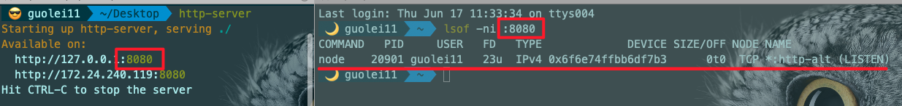

--- 
title: 一些常忘命令、工具的笔记
date: 2021-06-17
sidebar: 'auto'
categories: 
 - 短篇博文
tags: 
 - 笔记
publish: true
---

<!-- more -->

## shell

- 查看某个端口号占用情况

```bash
# lsof 关于linux文件相关的查找（主要是和socket相关)

# 列出关于8601端口的相关进程
lsof -ni :8601

# 关闭进程 20901为举例的进程PID
kill 20901
```



- 打开IOS模拟器

```bash
open -a Simulator
```

- 执行某个命令，并且放到后台执行`&`

```bash
http-server&
```

- 查看后台执行的进程

```bash
jobs -l
```

- 将任务转换到前台执行

```bash
# 使用fg命令将任务从后台执行转换到前台执行
fg
```

- 关闭谷歌浏览器的跨域限制

```bash
# 执行后可能出现用户数据丢失(收藏标签、插件等)
open -n /Applications/Google\ Chrome\ Cors.app/ --args --disable-web-security --user-data-dir=/Users/guolei11/ChromeCorsUserData/
```

```bash
# 开启跨域浏览器，打开指定网页 比如 c http://i7xy.cn
c() {
  open -n -a /Applications/Google\ Chrome.app/Contents/MacOS/Google\ Chrome $1 --args --user-data-dir="/tmp/chrome_cors" --disable-web-security
}
```

- 开发机文件上传下载(rz/sz)：参照`docs/FE/短篇/开发机文件上传和下载.md`

## git

- 将当前所有的提交相对线上master创建新的一个提交，将所有变更提交代码加入工作区

```bash
git reset origin/master --soft
```

- 使用线上最新master代码新建分支，并切换到对应分支

```bash
git checkout -b <分支名> origin/master
```

- 改变当前提交的基准至线上master代码

```bash
git pull --rebase origin master
```

- 解决冲突

```bash
git pull --rebase origin master
git add .
git rebase --continue
git push origin HEAD:refs/for/master

# 取消rebase
git rebase --abort
```

- 当本地分支没和远程master关联时，提交当前代码到远程master

```bash
git push -u origin master

# 等同于
git push --set-upstream origin master
```

- 撤销所有的已经add的文件 (相对 git add .)

```bash
git reset HEAD .
```

- git stash

```bash
git add .
# 保存当前代码至stash，可以带备注信息
git stash save "something info"

# pop stash 0
git stash pop

# 查看stash信息
git stash list

# pop {1}
git stash pop stash@{1}
```

- 配置多个git (github/gitlab/other_git)

```bash
# gitlab
Host icode
    User git
    HostName gitlab.xxx.com
    PreferredAuthentications publickey
    IdentityFile ~/.ssh/gitlab_rsa

# gitee
Host icode
    User git
    HostName git@gitee.com
    PreferredAuthentications publickey
    IdentityFile ~/.ssh/github_rsa

# github
Host github
    User git
    HostName github.com
    PreferredAuthentications publickey
    IdentityFile ~/.ssh/github_rsa

Host *
ControlMaster auto
ControlPath ~/.ssh/master-%r@%h:%p
ControlPersist yes
ServerAliveInterval 60
```

- 添加ssh私钥到ssh缓存区

```bash
ssh-add ~/.ssh/xxx_rsa
ssh-add ~/.ssh/github_rsa
```

- 其他命令 (待解析)

```bash
# git merge和git merge --no-ff的区别，默认使用的模式是--ff
git merge --no-ff <分支名>

git merge --no-commit --squash <HASH>
```

## tool

### iterm2

- hot window: `other-files/hot_win_key.json`

- 常用插件

```bash
plugins=(
    git
    zsh-autosuggestions
    autojump
    # zsh-syntax-highlighting
)
# fzf
source $ZSH/oh-my-zsh.sh
source /usr/local/share/zsh-syntax-highlighting/zsh-syntax-highlighting.zsh
```

- 用户名开头随机emoji

```bash
prompt_context() {
  emojis=("⚡️" "🔥" "👑" "😎" "🐸" "🐵" "🦄" "🌈" "🍻" "🚀" "💡" "🎉" "🔑" "🚦" "🌙")
  RAND_EMOJI_N=$(( $RANDOM % ${#emojis[@]} + 1))
  if [[ "$USER" != "$DEFAULT_USER" || -n "$SSH_CLIENT" ]]; then
    prompt_segment black default "%(!.%.)${emojis[$RAND_EMOJI_N]} $USER"
  fi
}
export PATH=/Applications/XAMPP/bin:$PATH
```

### Charles

- map-remote path，from的path比to的path需要少一个`/`，比如from: `a/b`，则to: `/a/b`

### standard config

- 文档：[https://standardjs.com/readme-zhcn.html](https://standardjs.com/readme-zhcn.html)

安装 vscode-standard（已经包含了自动格式化）。

安装 vscode-standardjs-snippets 以获得 JS snippets。安装 vscode-react-standard 以获得 React snippets。

> 只需要安装vscode-standard就可以实现自动格式化，另外两个插件没深入看

PS:

- babel-eslint升级到@babel/eslint-parser，xen中解析有问题，所以usePackageJson要设置为false，使用vscode中自己配置的解析规则。
- `files.autoSave`不能设置为`afterDelay`

```json
{
    "files.autoSave": "onFocusChange",
    "standard.enable": true,
    "standard.autoFixOnSave": true,
    "standard.run": "onType",
    "standard.engine": "standardx",
    "standard.usePackageJson": false,
    "standard.options": {
      "globals": ["$", "jQuery", "fetch"],
      "ignore": [
        "node_modules/**"
      ],
      "parser": "babel-eslint",
    },
}
```

## data

### 学习资料

- 小册: `other-files/some-jj-books.zip`，密码133(tip: QQ)
